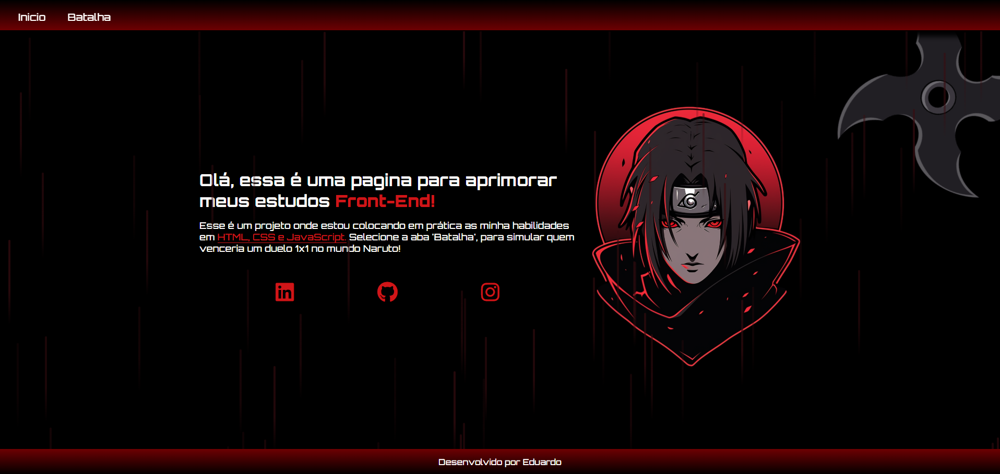

# Naruto Battle Simulator 



Um site interativo inspirado no universo de Naruto, onde você pode simular batalhas entre personagens e descobrir quem venceria com análise da inteligência artificial do Google Gemini.

## Funcionalidades

- **Simulação de Batalhas**: Escolha dois personagens do universo Naruto para enfrentarem-se
- **Análise por IA**: Integração com a API do Gemini AI para analisar combates e determinar o vencedor 
- **Design Temático**: Interface inspirada no anime, com elementos visuais característicos
- **Responsivo**: Adaptado para diferentes tamanhos de tela

## Tecnologias Utilizadas

- HTML 5
- CSS3 
- JavaScript
- Google Gemini AI

## Atualizações

Esse é o meu primeiro projeto sendo feito do zero, irei fazendo atualizações conforme eu vou avançando meu aprendizado.

Link do projeto em execução: https://naruto-battle-ai-ovng.vercel.app/

<div align="center"> Feito por [Eduardo] | <a href="https://github.com/EduardoDevPy">GitHub</a> | <a href="https://www.linkedin.com/in/eduardo-vieira-97a489182/">LinkedIn</a> </div> ```
